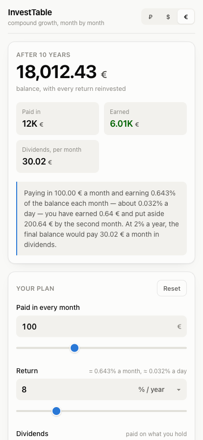

# InvestTable

**Try it:** [product page](https://mrwd.github.io/products/invest-table/) · [TestFlight beta](https://testflight.apple.com/join/ThAa955N)



The "Revenue Chart" spreadsheet, as an app — on the web, on a desktop, on Android and on
iPhone, from one codebase.

You type in what you pay in every month, what it earns every month, and what the position
pays in dividends every year. It projects the balance month by month, laid out in the same
year blocks the sheet used, with the growth curve above it and a currency converter below.

Everything stays on the device. There is no account, no server holding your figures, and
the only thing ever fetched is the day's exchange rates — which the app works without.

## The model

Three inputs, one recurrence, taken from the spreadsheet's own numbers:

```
balance[1] = deposit
balance[n] = balance[n-1] × (1 + monthly rate) + deposit
income[n]  = balance[n-1] × monthly rate

dividend per month, year Y = balance at the end of year Y-1 × annual rate ÷ 12
```

Every figure is rounded to cents and the next month compounds the rounded one, exactly as
the sheet does — which is why its column reads 2 138,44 at month 12 where unrounded
arithmetic gives 2 138,43.

`npm run check` holds the port to that: it asserts 72 values read off the original
spreadsheet, across two settings (100 at 10 % a month, and 1000 at 5 %), including the
dividend column. If a change to `src/lib/projection.ts` breaks agreement with the sheet,
that script fails.

## Languages

Twenty, picked up from the device on first launch and changeable in the footer:

Bahasa Indonesia · Čeština · Deutsch · English · Español · Français · Italiano ·
Nederlands · Polski · Português · Svenska · Tiếng Việt · Türkçe · العربية · Русский ·
Українська · हिन्दी · 中文 · 日本語 · 한국어

Numbers, percentages, dates and plurals all follow the chosen language, not a fixed
format: German reads "25 Mio." where Japanese reads "2500万", Hindi groups by lakh, and
Russian, Polish, Czech and Arabic each get their own plural forms from `Intl.PluralRules`.
Arabic also flips the layout — the stylesheet uses logical properties, so there is no
second stylesheet, and the chart deliberately stays left-to-right.

To add a language: copy `src/i18n/locales/en.ts`, translate, and add one row to
`LANGUAGES` in `src/i18n/index.ts`. `satisfies Catalogue` turns any missing key into a
build error, so `npm run build` is the check.

## Running it

```bash
npm install
npm run dev       # http://localhost:5173
```

```bash
npm run build && npm run preview   # production build on :4173
npm run check                      # the model against the spreadsheet
npm run lint
```

## The four targets

| Target | How | Notes |
|---|---|---|
| Web | `npm run build`, serve `dist/` | a PWA: offline after first load |
| Desktop | install the web app from Chrome or Edge | own window, dock/taskbar icon, works offline |
| Android | `npm run build:native && npx cap sync android && npx cap open android` | Capacitor shell in `android/` |
| iOS | `npm run build:native && npx cap sync ios && npx cap open ios` | Capacitor shell in `ios/` |

**Use `build:native`, never plain `build`, for the store builds.** It ships without a
service worker and destroys any already installed. Inside the native shell every file is
already on the device, so the worker adds nothing — and it takes something away: a build
installed over another goes on serving the previous one, which has cost the sibling
projects two rounds of "it still does the old thing".

Icons and splash screens all come from `public/favicon.svg`:

```bash
node scripts/gen-icons.mjs      # web icons + the assets/ pair
npx @capacitor/assets generate --iconBackgroundColor '#1a1a19' \
  --splashBackgroundColor '#f9f9f7' --splashBackgroundColorDark '#0d0d0d'
```

`@capacitor/assets` also writes a PWA manifest and webp icons at the repo root. Delete
them — `vite-plugin-pwa` owns the web manifest, and the ones that tool writes point at the
wrong paths with the wrong mime type.

## Layout

```
src/lib/projection.ts   the model, and the only file `npm run check` guards
src/lib/format.ts       one number format, the sheet's own: "1 593,75"
src/lib/rates.ts        exchange rates: live → device cache → bundled → hand-edited
src/i18n/              twenty catalogues, plural resolution, language detection
src/store/settings.ts   every input, persisted to localStorage
src/components/         controls, summary, chart, year table, converter,
                        support, more-from-the-author
src/native.ts           status bar, splash, back button, haptics — all no-ops on the web
```

The project list in `src/components/MoreFromAuthor.tsx` is a copy of the canonical one in
`products-page/app.js` — kept thin on purpose (emoji, name, one line, one link) so there
is little to drift. Add a project there first, then here.

## Not investment advice

A projection is not a forecast. It assumes the return you type in arrives every month
without fail and is reinvested in full, and counts no fees, taxes, spreads or inflation.
The sheet's own default — 10 % a month — is an extraordinary return, and the app neither
endorses it nor caps you below it.

MIT.
